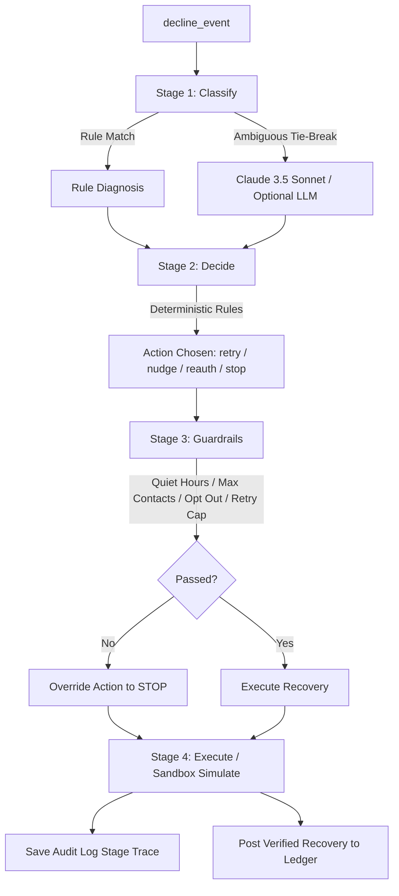

# Mandate Rescue

> **Autonomous UPI Autopay Recovery Engine**  
> Find failed mandates. Recover revenue. Stay compliant.

Mandate Rescue is an agentic payment-recovery engine for failed UPI Autopay / e-mandate subscription payments. It detects payment failures, identifies their root cause, selects a bounded recovery action, applies compliance guardrails, simulates execution, and records verified recoveries in an auditable financial ledger.

It is the first implemented recovery module inside the broader **Revenue Immune System (RIS)** concept: a reusable shell for detecting, diagnosing, and recovering revenue at risk.

> **Demo safety note:** This project uses synthetic transaction data and sandboxed outcomes. It does not debit real accounts, connect to live merchant payment rails, send SMS/WhatsApp messages, make voice calls, or contact real customers.

---

## Problem

Recurring payments rarely fail for one single reason.

A UPI Autopay mandate may fail because of:

- Insufficient customer balance
- Bank downtime or network timeout
- Expired, revoked, or paused mandate
- Daily UPI limit or amount constraint
- Wrong debit date or invalid execution window
- Unclear provider error messages

Most recovery workflows treat all these failures the same way: retry once later or send a generic reminder. This can waste retries, annoy customers, violate contact-frequency limits, and leave recurring revenue unrecovered.

Mandate Rescue treats every failed mandate as an individual recovery case:

```text
Detect failure
      ↓
Diagnose root cause
      ↓
Choose the right recovery action
      ↓
Check compliance constraints
      ↓
Execute a bounded workflow
      ↓
Measure recovered ₹ and retain an audit trail
```

---

## Solution

Mandate Rescue processes a batch of failed UPI Autopay / e-mandate subscription transactions through a working, deterministic recovery pipeline.

For each failure, the system:

1. Identifies the likely cause using payment error codes, messages, and transaction metadata.
2. Uses an optional LLM tie-breaker only when deterministic classification is ambiguous.
3. Chooses a cause-specific recovery action using deterministic policy rules.
4. Applies hard guardrails before any action can execute.
5. Simulates the approved recovery action in a sandbox.
6. Records the complete stage-by-stage decision trace.
7. Posts each verified recovery to an immutable Recovery Ledger.
8. Calculates recovered revenue from actual ledger entries, not frontend mock values.

---

## RIS Shell Architecture

The recovery pipeline operates as a linear four-stage state machine for every failed mandate transaction.



### 1. Classify — Ingest and Detection Layer

The system receives a failed mandate event and identifies the likely root cause.

It uses fast, deterministic regex and error-code rules first. For ambiguous failures only, it can use an optional LLM tie-breaker.

Supported root-cause categories:

| Failure cause | Example payment signal | Typical classification method |
|---|---|---|
| Low Balance | `UPI_INSUFFICIENT_FUNDS`, `PYMT_BAL_LOW` | Rule-based |
| Bank Offline | Bank timeout, temporary issuer error, network issue | Rule-based |
| Expired Mandate | Mandate revoked, inactive, expired, paused | Rule-based |
| Limit Exceeded | Daily UPI limit or amount threshold reached | Rule-based |
| Wrong Debit Date | Invalid debit window or schedule conflict | Rule-based |
| Unknown / Ambiguous | Unclear or conflicting provider details | Optional LLM tie-breaker |

The LLM is not responsible for money movement, retry limits, or compliance decisions. It is used only as a fallback classification assistant for unclear error data.

### 2. Decide — Decision and Escalation Layer

After classifying a transaction, the decision engine maps the failure cause and customer payment history to a recovery action.

Decision-making is deterministic and explainable.

| Root cause | Example customer context | Action selected | Why |
|---|---|---|---|
| Low balance | Strong past payment success rate | Soft Hinglish nudge + delayed retry | Give a trusted customer time to restore balance |
| Low balance | Weak or erratic payment history | Salary-window retry / stop | Avoid repetitive, low-value contact |
| Bank offline | Technical timeout | Retry through the permitted recovery path | Technical problems may resolve quickly |
| Expired mandate | Revoked or expired mandate | Re-authorisation request | Blind retry cannot repair an invalid mandate |
| Limit exceeded | UPI / mandate limit reached | Delayed or split retry | Retry after an appropriate reset window |
| Wrong debit date | Debit-window conflict | Reschedule | Retry only in a valid execution window |
| Any blocked case | Opt-out, retry cap, contact cap, kill-switch | Stop | Customer safety and policy override recovery |

The escalation ladder is intentionally bounded:

```text
nudge → retry → re-authorise → voice channel → stop
```

Voice is represented as a future escalation channel unless a real consented voice integration is implemented. The current system does not claim to place real voice calls.

### 3. Guardrails — Bounded Executor

Before an action can proceed, Mandate Rescue evaluates compliance and customer-protection rules.

| Guardrail | Policy |
|---|---|
| Quiet hours | No customer contact from 8:00 PM to 9:00 AM IST |
| Retry cap | Maximum 3 automated retries per mandate |
| Nudge cap | Maximum 2 nudges per customer per week |
| Opt-out check | Never contact a customer who opted out |
| Consent check | Higher-touch escalation requires appropriate consent |
| Kill-switch | A global pause can stop simulated outbound actions |
| Bounded workflow | No unbounded retry loops or repeated contacts |

If guardrails fail, the selected action is overridden to:

```text
STOP
```

A stopped transaction is a correct safety outcome, not a pipeline failure.

### 4. Execute and Post — Recovery Ledger

The executor runs an approved action in sandbox simulation mode and creates a full trace for audit review.

Execution records include:

- Selected recovery action
- Action timing
- Guardrail outcome
- Simulated execution result
- Final transaction outcome
- Recovery amount, where applicable
- Stage-by-stage audit trail

If the simulation verifies recovery, the transaction is immediately posted to the Recovery Ledger as an immutable entry.

```text
One successful recovered transaction = one ledger entry
```

This design prevents double counting and ensures that every displayed recovered-₹ metric can be reconciled to ledger rows.

---

## Recovery Pipeline

```text
Failed UPI mandate transaction
            ↓
Stage 1: Classify root cause
            ↓
Stage 2: Select deterministic action
            ↓
Stage 3: Apply compliance guardrails
            ↓
Stage 4: Execute sandbox recovery workflow
            ↓
Audit log + Recovery Ledger
            ↓
Measured ₹ recovered
```

### Classification

The classifier uses deterministic error-code mappings first.

Example:

```text
UPI_INSUFFICIENT_FUNDS
      ↓
low_balance
      ↓
Rule-based classification
      ↓
High confidence
```

For ambiguous error messages, an optional LLM tie-breaker can provide a suggested category. The pipeline remains operational without any LLM API key.

### Decision Engine

The decision engine is deterministic rather than LLM-controlled.

This is intentional:

- Recovery rules need to be testable.
- Contact and retry limits must not be probabilistic.
- Financial outcomes need repeatable logic.
- Compliance decisions must be explainable.

### Guardrails

Guardrails have authority over recovery actions.

```text
Decision says: send nudge
      ↓
Guardrail says: customer opted out
      ↓
Final action: STOP
```

### Execution

The current implementation simulates recovery outcomes from configured action and failure patterns. It does not connect to a real bank, UPI rail, Razorpay merchant account, SMS provider, WhatsApp API, or voice provider.

---

## Recovery Actions

| Action | Used for | Current behavior |
|---|---|---|
| `retry` | Temporary bank or technical failure | Simulated retry through the recovery workflow |
| `nudge` | Eligible low-balance / trusted customer | Generates a safe preview message; does not send it |
| `reauth` | Expired, revoked, or invalid mandate | Simulates fresh mandate re-authorisation request |
| `split_retry` | Limit-exceeded scenarios | Simulates delayed/split recovery strategy |
| `reschedule` | Wrong debit date/window | Schedules a valid recovery window in simulation |
| `stop` | Guardrail failure or exhausted recovery attempts | Stops automation and logs reason |

---

## Hinglish Nudge Preview

For eligible cases, Mandate Rescue supports respectful Hinglish recovery-message previews.

Example:

```text
Namaste {{firstName}},

Aapka {{brandName}} subscription payment ₹{{amount}} complete nahi ho paya.

Aap yahan ek tap mein payment complete kar sakte hain:
{{paymentLink}}

Agar aap already payment kar chuke hain, please ignore this message.
```

Message previews are only produced when guardrails allow them.

The current application:

- Does not send real SMS messages
- Does not send real WhatsApp messages
- Does not place real voice calls
- Does not create real payment links
- Does not contact real customers

Every nudge is clearly labeled:

```text
Preview only — no customer communication is sent.
```

---

## Recovery Ledger

The Recovery Ledger is the financial source of truth.

Every verified recovery is stored as an immutable entry:

```text
transaction_id
amount
currency
failure_cause
recovery_action
channel
timestamp
confidence
outcome
idempotency_key
```

The ledger must satisfy this invariant:

```text
One transaction ID may have only one recovery ledger entry.
```

All recovery KPIs are calculated from actual ledger entries:

```text
Total Recovered = Sum of ledger entry amounts
```

The dashboard reconciliation check verifies:

```text
Displayed recovery total = Sum of individual ledger rows
```

---

## Current Simulation Batch

The project includes a synthetic generator that creates **300 failed UPI Autopay / e-mandate transactions** with realistic error patterns, customer histories, amounts, banks, subscription types, timestamps, and mandate IDs.

### Input data example

```json
{
  "id": "txn_00001",
  "customer_id": "cust_0034",
  "amount": 828,
  "currency": "INR",
  "mandate_id": "mand_P9Q3UMVL",
  "bank_name": "Federal Bank",
  "error_code": "UPI_INSUFFICIENT_FUNDS",
  "error_message": "The account does not have sufficient balance to complete the transaction.",
  "failed_at": "2026-08-23T15:38:32.359Z",
  "customer_payment_history": {
    "past_success_rate": 0.21,
    "avg_balance_pattern": "low",
    "payment_timing": "late",
    "opt_out": false,
    "recent_nudges_count": 0,
    "past_retry_attempts": 3
  },
  "subscription_type": "Newspaper Daily Nudge"
}
```

### Current verified batch processing state

| Pipeline collection | Count |
|---|---:|
| Generated failed transactions | 300 |
| Root-cause classifications | 300 |
| Recovery decisions | 300 |
| Guardrail checks | 300 |
| Execution records | 300 |
| Audit records | 300 |
| Promise-to-pay records | 0 |
| Recovery Ledger entries | Verify through reconciliation |

### Representative batch result

| Metric | Result |
|---|---:|
| Total volume at risk | ₹9,78,443 |
| Total volume recovered | ₹4,43,394 |
| Recovery rate | 45.32% |
| Recovered mandates | 133 |
| Stopped mandates | 54 |
| Pending mandates | 113 |

> These figures are from the local simulation run. Verify ledger reconciliation before using final metrics in a demo or submission.

---

## Dashboard

Mandate Rescue is implemented as a Next.js App Router application with a premium dark dashboard interface.

### Routes

| Route | Purpose | Data source |
|---|---|---|
| `/` | Overview of batch risk, recoveries, funnel, and KPIs | `transactions`, `executions`, `ledger`, `audit_log` |
| `/ingest` | Synthetic failure-batch ingestion and distributions | `transactions` |
| `/decisions` | Classification, decision reasoning, and escalation state | `classifications`, `decisions` |
| `/guardrails` | Allowed/blocked actions and compliance rule outcomes | `guardrail_checks` |
| `/promises` | Promise-to-pay commitments | `promises` |
| `/audit` | Searchable, filterable cross-transaction audit trail | `audit_log` |
| `/ledger` | Recovery Ledger and reconciliation | `ledger` |
| `/nudges` | Hinglish nudge preview generator | Joined transaction and decision records |
| `/transactions` | Searchable list of all failed mandates | Normalized data from all collections |
| `/transactions/[id]` | Transaction-level four-stage audit stepper | Joined transaction data |

### UI system

- Premium dark visual theme using deep slate and zinc tones
- Subtle glassmorphism and low-opacity emerald borders
- Emerald for recovered money and successful states
- Rose/red for money at risk, blocked actions, and failed outcomes
- Amber for deferred, capped, or pending conditions
- Inter for body content and labels
- Plus Jakarta Sans for headings and product navigation
- Monospace typography for currency values, IDs, confidence scores, and audit logs
- Micro-animations for active batch states, hover interactions, and status transitions

---

## Data Model

When `DATABASE_URL` is absent, the application uses a local JSON database at:

```text
data/db.json
```

The current fallback schema is:

```json
{
  "transactions": [],
  "classifications": [],
  "decisions": [],
  "guardrail_checks": [],
  "executions": [],
  "audit_log": [],
  "promises": [],
  "ledger": [],
  "settings": {}
}
```

### Data ownership

| Data | Source collection |
|---|---|
| Failed mandate input | `transactions` |
| Root-cause classification | `classifications` |
| Action and reasoning | `decisions` |
| Compliance evaluation | `guardrail_checks` |
| Sandbox outcome | `executions` |
| Stage-by-stage trace | `audit_log` |
| Promise-to-pay records | `promises` |
| Recovered revenue | `ledger` |
| Kill-switch and runtime configuration | `settings` |

Records are joined by transaction ID:

```text
transaction.id === pipelineRecord.transaction_id
```

---

## Tech Stack

| Layer | Technology |
|---|---|
| Framework | Next.js with App Router |
| Language | TypeScript |
| Styling | Tailwind CSS |
| UI | Reusable premium dark dashboard components |
| Database | PostgreSQL when `DATABASE_URL` is configured |
| Local fallback | JSON database at `data/db.json` |
| Recovery engine | Pure TypeScript modules |
| Execution mode | Synthetic batch simulation |
| AI usage | Optional LLM tie-breaker for ambiguous classification only |

---

## Project Structure

```text
mandate-rescue/
├── data/
│   └── db.json
├── scripts/
│   ├── generate-data.ts
│   ├── run-batch.ts
│   ├── verify-data.ts
│   ├── verify-ledger.ts
│   └── verify-api-data.ts
├── src/
│   ├── app/
│   │   ├── api/
│   │   │   ├── audit/
│   │   │   ├── decisions/
│   │   │   ├── guardrails/
│   │   │   ├── ingest/
│   │   │   ├── ledger/
│   │   │   ├── nudges/
│   │   │   ├── overview/
│   │   │   ├── promises/
│   │   │   └── transactions/
│   │   ├── audit/
│   │   ├── decisions/
│   │   ├── guardrails/
│   │   ├── ingest/
│   │   ├── ledger/
│   │   ├── nudges/
│   │   ├── promises/
│   │   ├── transactions/
│   │   └── page.tsx
│   ├── components/
│   │   ├── brand/
│   │   │   └── MandateRescueLogo.tsx
│   │   └── ui/
│   │       └── index.tsx
│   └── lib/
│       ├── classifier.ts
│       ├── db.ts
│       ├── decider.ts
│       ├── executor.ts
│       ├── guardrails.ts
│       ├── ledger.ts
│       ├── normalizers.ts
│       ├── nudges.ts
│       ├── pipeline.ts
│       └── types.ts
├── tailwind.config.ts
├── package.json
└── README.md
```

> File names may vary slightly based on the current implementation. The core requirement is that recovery logic remains independent of the frontend and can run through standalone scripts.

---

## Getting Started

### Prerequisites

- Node.js 18+
- npm, pnpm, or yarn
- Terminal access from the project root

### Install dependencies

```bash
npm install
```

### Environment configuration

Create `.env.local` only if you want optional PostgreSQL or LLM support.

```env
# Optional. If omitted, the project uses data/db.json.
DATABASE_URL=

# Optional. Required only for LLM tie-break classification.
ANTHROPIC_API_KEY=
```

The core pipeline must work without these variables using:

```text
Local JSON DB + deterministic rule engine
```

### Generate synthetic failed mandates

```bash
npx tsx scripts/generate-data.ts
```

Expected output:

```text
Generating 300 synthetic failed transactions...
Using local JSON database fallback...
Local JSON file populated! Saved 300 transactions in data/db.json
```

### Run the recovery pipeline

```bash
npx tsx scripts/run-batch.ts
```

This executes:

```text
Classify → Decide → Guardrails → Execute → Audit → Ledger
```

Expected output:

```text
Recovery batch execution completed successfully!

--- BATCH METRICS REPORT ---
Total Volume At Risk : ₹...
Total Volume Recovered: ₹... (...%)
Recovered Mandates    : ...
Failed Mandates       : ...
Stopped Mandates      : ...
Pending Mandates      : ...
----------------------------
```

### Start the dashboard

```bash
npm run dev
```

Open:

```text
http://localhost:3000
```

### Verify generated data

```bash
npx tsx scripts/verify-data.ts
```

### Verify ledger integrity

```bash
npx tsx scripts/verify-ledger.ts
```

### Verify normalized dashboard/API data

```bash
npx tsx scripts/verify-api-data.ts
```

For development diagnostics:

```text
http://localhost:3000/api/transactions?debug=true
```

---

## API Routes

| Endpoint | Purpose |
|---|---|
| `GET /api/overview` | Total risk, recovery KPIs, funnel, and failure-cause breakdown |
| `GET /api/transactions` | Paginated and filterable normalized transaction list |
| `GET /api/ingest` | Synthetic batch ingestion state and distributions |
| `GET /api/decisions` | Root cause, selected action, and deterministic reasoning |
| `GET /api/guardrails` | Compliance-check outcomes and guardrail events |
| `GET /api/audit` | Searchable audit trail across all stages |
| `GET /api/ledger` | Recovery ledger, reconciliation, and breakdowns |
| `GET /api/promises` | Promise-to-pay data and honest zero-state |
| `GET /api/nudges` | Guardrail-aware Hinglish nudge previews |

---

## Example Transaction Trace

```text
Transaction ID: txn_00042
Amount: ₹1,499
Error code: UPI_INSUFFICIENT_FUNDS

Stage 1 — Classify
Cause: low_balance
Method: rule-based
Confidence: 0.95

Stage 2 — Decide
Action: nudge + scheduled retry
Reason: Customer has strong historical payment behavior and is eligible for contact.

Stage 3 — Guardrails
Opt-out: false
Retries: 1 / 3
Nudges: 0 / 2 this week
Quiet hours: not active
Final permission: allowed

Stage 4 — Execute
Mode: sandbox simulation
Outcome: Recovered
Recovered revenue: ₹1,499
Ledger status: posted
Audit trace: saved
```

---

## Metrics

Mandate Rescue is evaluated on measurable recovery and safety outcomes.

| Metric | Definition |
|---|---|
| Total amount at risk | Sum of all generated failed-transaction amounts |
| Total recovered | Sum of verified Recovery Ledger entries |
| Recovery rate | `total recovered / total amount at risk × 100` |
| Recovered mandates | Count of unique recovered transaction IDs |
| Pending mandates | Transactions waiting for later action or customer dependency |
| Stopped mandates | Transactions safely stopped by policy or guardrails |
| Recovery rate by cause | Recovered value divided by at-risk value for each cause |
| False-positive nudge cost | Cost assigned to permitted but non-converting nudges |
| Ledger reconciliation | Check that dashboard totals equal ledger-row totals |

---

## What Is Implemented

| Capability | Status |
|---|---|
| Synthetic mandate-failure generation | Implemented |
| Batch processing of 300 transactions | Implemented |
| Rule-based root-cause classification | Implemented |
| Optional LLM tie-breaker | Configuration-dependent |
| Deterministic decision engine | Implemented |
| Retry, nudge, re-auth, reschedule, stop actions | Simulated |
| Retry cap | Implemented |
| Nudge-frequency cap | Implemented |
| Opt-out protection | Implemented |
| Quiet-hour protection | Implemented |
| Global kill-switch model | Implemented / simulation-controlled |
| Bounded execution workflow | Implemented |
| Per-transaction audit log | Implemented |
| Recovery Ledger | Implemented |
| Ledger reconciliation | Must be verified before final demo |
| Hinglish nudge previews | Preview/simulation only |
| Real SMS or WhatsApp delivery | Not implemented |
| Real customer voice calls | Not implemented |
| Live UPI / payment-gateway debits | Not implemented |
| Production prediction / digital-twin layer | Not implemented |

---

## Future Work

The following are roadmap items and are **not claimed as currently shipped functionality**.

1. **Live payment-rail integration**  
   Ingest real merchant failure events using a provider webhook/API integration after sandbox testing, consent design, security review, and merchant approval.

2. **Checkout Abandonment Rescue**  
   Extend the same RIS workflow to payment drop-offs and abandoned checkout sessions.

3. **B2B Receivables Chaser**  
   Add invoice recovery, approval-aware escalation, payment-link workflows, and account-manager handoff.

4. **Promise-to-Pay Automation**  
   Capture inbound customer commitments from approved channels and schedule guardrail-compliant follow-ups.

5. **Tamil and regional-language support**  
   Add merchant-approved communication templates for Tamil and additional regional languages.

6. **Hinglish Voice Recovery**  
   Add a consented voice escalation channel for higher-value cases. This is future work; the current system does not make real voice calls.

7. **Shared prediction layer**  
   Build a future learning layer to estimate optimal recovery timing, channel, and action using historical recovery outcomes. This is not currently implemented or represented as a live capability.

---

## Demo Flow

A strong five-minute demonstration follows this sequence:

1. Open **Overview** and show total ₹ at risk, total ₹ recovered, and recovery rate.
2. Open **Ingest** and show the 300 synthetic failed mandate events.
3. Open **Decisions** and compare two cases:
   - Low balance → soft nudge / delayed retry
   - Expired mandate → re-authorisation, not blind retry
4. Open **Guardrails** and show an action blocked by opt-out, retry cap, nudge cap, or quiet hours.
5. Open **Transactions**, select one transaction, and inspect the full four-stage audit stepper.
6. Open **Recovery Ledger** and show that recovered ₹ is backed by immutable ledger entries.
7. Show the reconciliation result.
8. Close with:

> “Mandate Rescue processed failed UPI Autopay mandates, diagnosed each root cause, selected bounded recovery actions, enforced customer-protection guardrails, and measured recovered revenue through an auditable ledger.”

---

## Disclaimer

Mandate Rescue uses synthetic transaction data and simulated outcomes for hackathon, demonstration, and educational purposes.

It does not process real UPI payments, debit real bank accounts, collect money, send real messages, conduct voice calls, or provide financial, legal, or regulatory advice.

Any production deployment would require payment-provider approval, secure credential handling, encryption, consent management, compliance review, access control, observability, incident response, and merchant governance.